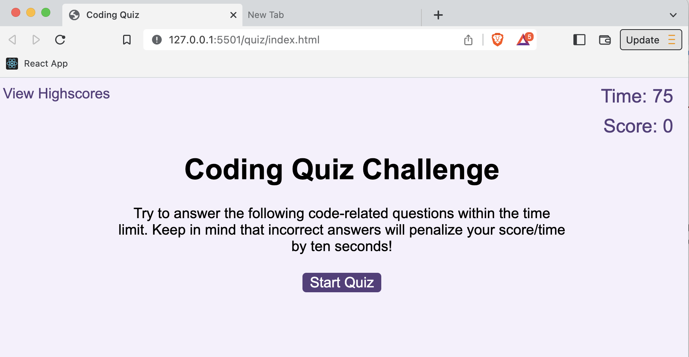
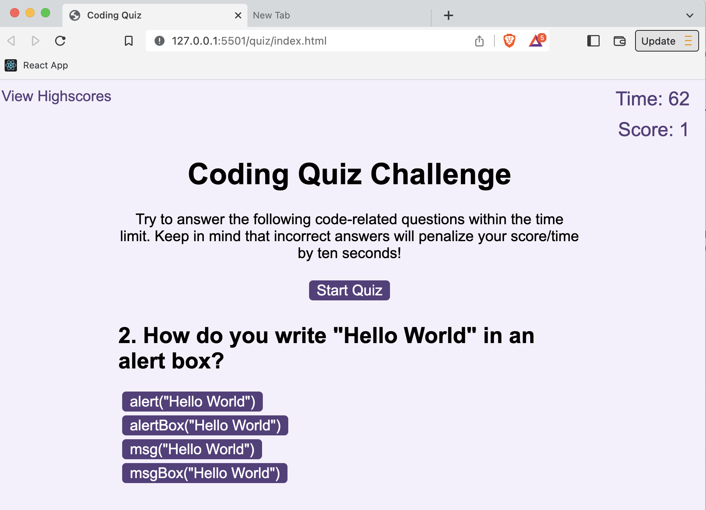
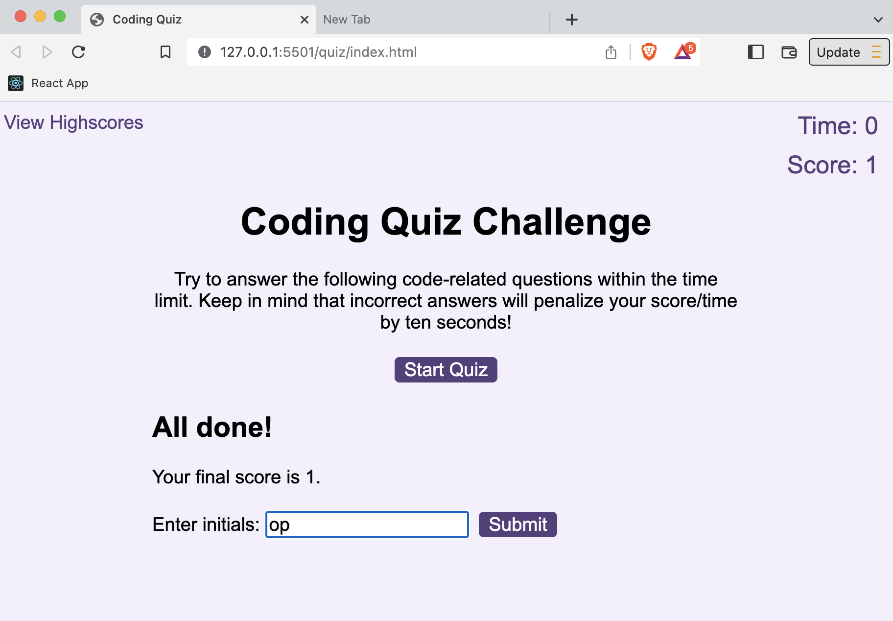
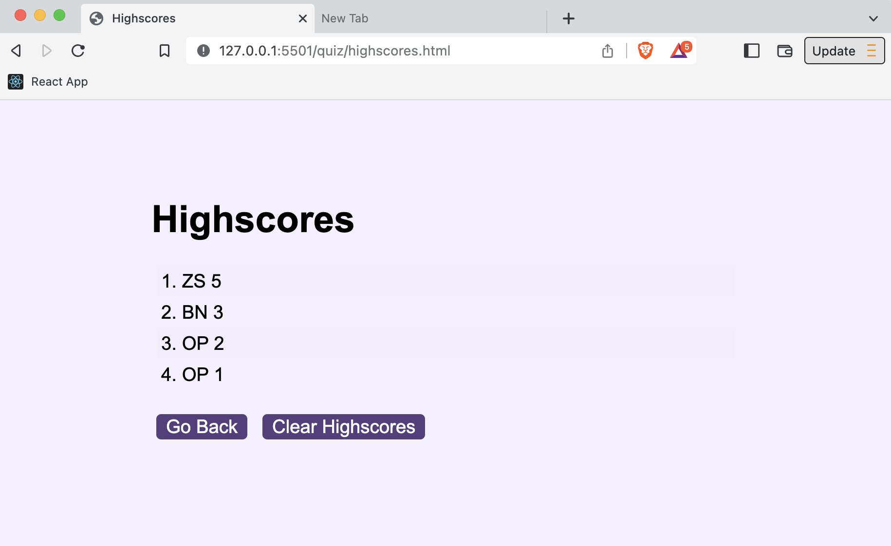

# JavaScript Quiz

## Quiz is live at https://ljenchik.github.io/quiz/

I created a multiple choices code quiz which contains five random questions about JavaScript. When a user clicks on a start button a timer starts and the first question appears. Only one of the available answers can be chosen. When answer is clicked, the next question appears. If the answer clicked was incorrect then ten seconds are subtracted from the timer. The quiz ends when all questions are answered or the timer reaches 0. When the game ends, it displays a table with players' initials and their scores. 
  

